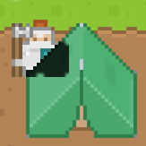

# Defold Silhouette Demo

This is an example of how to achieve silhouette effect when sprite are not visible against other sprites. One can use this to highlight a hero in a top-down game, when it is behind buildings or other objects.

Based on [this blog post](https://blog.vfrz.fr/2d-silhouette-effect-in-opengl/#draw-the-silhouette-only-where-needed) by Valentin Fritz.

This effect achieved with usage of custom materials and modified render script.

### Materials:
- Player - this is just builtin Sprite material, but with a unique predicate.
- Sprite, Label, Tile Map materials - they have additional `discard` in the shader to prevent transparent parts of the sprite to block the player. 
- Silhouette - material just to show solid color. You can change color inside the shader, or send it as a constant. Be aware of additional artifacts if color non-black (0, 0, 0). It could be partially fixed with additional `discard` (see comment in the shader).

### Custom Render script.
All changes are made inside the `update` function. Key points:
- keep `render.set_depth_mask(true)` enabled.
- enable and configure stencil test.
- draw all `tile` predicate
- draw `player` predicate only to stencil buffer
- disable `STATE_DEPTH_TEST` and draw `player` with `silhouette` material
- draw `player` as usual
- draw everything else (debug, gui) as usual

Example works without an additional stencil mask, but it would have some artifacts.

### Demo examples:
- base-example - show simple configuration with 3 sprites on different z-position and a background.
- simple-example - has a tilemap with several objects on it and a hero. Hero move script changes his z-position according to y-position. All objects has their own z-position.

### Problems:
- Usage of `discard` in materials. I've heard this is a bad practice. And it leads to additional artifacts (see Label on player object at base demo).
- If the hero "holds" some objects, they are colored with silhouettes too. You need to play with grouping your objects and draw them as separate predicate.
- I can't get it working with Spine models. It gives me additional artifacts, and I don't know how to overcome them yet.
- This technique does additional Draw calls. Which could be bad for performance.
- Changing silhouette color to non black  leads to additional artifacts (partly fixed).
- Not tested with 3D models.

## TODO

- Optimize
- Spine example
- Change silhouette color from scripts
- 3D models example
- Add menu and HTML5 demo

## Assets

- Defold ["desktop game template"](https://github.com/defold/template-desktop/) assets
- [Kenney.nl](https://www.kenney.nl/assets)

---
